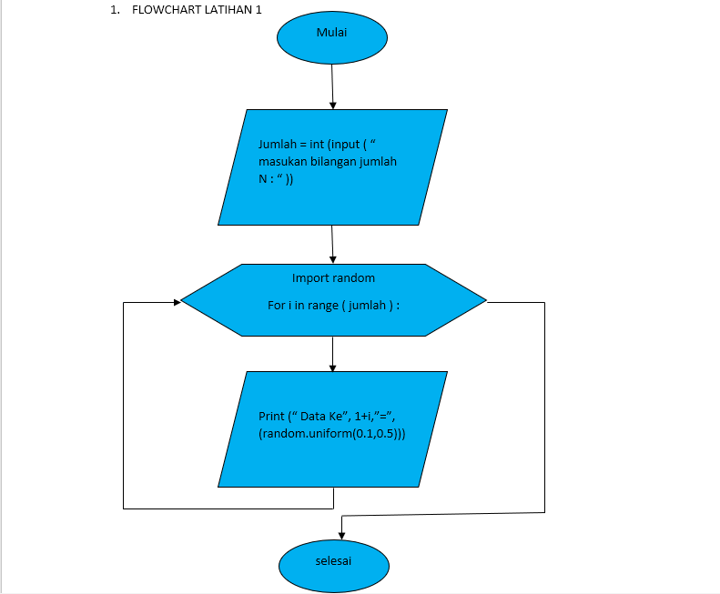
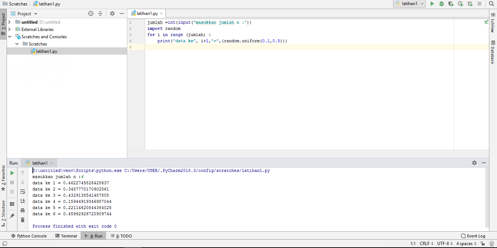
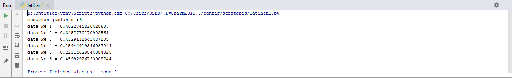

# labpy03
# Indira Rully 312110354

# Latihan 1
## A. Langkah untuk menampilkan N bilangan acak yang lebih kecil dari 0,5
1.Masukan Jumlah N pengulangan

2.Proses pengulangan sesuai jumlah pengulangan yang dinputkan

3.Tampilkan pengulangan dengan nilai di bawah 0.5

4.Selesai

## B. Flowchart program

## C. Program untuk menampilkan N bilangan acak yang lebih kecil dari 0,5

### Urutan pembuatan program
1.Ketikan Program print ('Tampilkan n Bilangan Acak yang Lebih Kecil Dari 0.5')

2.Ketikan Program jumlah=int(input("Masukan Jumlah N : "))

3.Ketikan Program import random

4.Ketikan Program for i in range ( jumlah ) :

5.Ketikan Program print("Data ke", 1+i,"=>", (random.uniform(0.1,0.5)))

### Penjelasan Alur Program
1.print ('Tampilkan n Bilangan Acak yang Lebih Kecil Dari 0.5') Untuk Menampilkan atau Mencetak kalimat Tampilkan N Bilangan Acak yang Lebih Kecil Dari 0.5

2.jumlah=int(input("Masukan Jumlah N : ")) Untuk menentukan jumlah input yang di inginkan sesuai tipe data yaitu interger tipe data bilangan bulat

3.import random*

4.for i in range ( jumlah ) : Untuk Pengulangan dengan range jumlah

5.print("Data ke", 1+i,"=>", (random.uniform(0.1,0.5))) Untuk menampilkan atau mencetak urutan data sesuai jumlah inputan dengan hasil di bawah 0.5

## D. Hasil

# Latihan 2

Urutan Pembuatan Program

Ketikan Program max= 0
Ketikan Program while true:
Ketikan Program a=int(input("Masukan Bilangan :"))
Ketikan Program if max < a
Ketikan Program max=a
Ketikan Program if a==0:
Ketikan Program break
Ketikan Program print("Bilangan Tebesar Adalah :", max)
Penjelasan Alur Program

max= 0 kode max disini untuk menentukan nilai max nya adalah 0
while true: Untuk perulangan hingga waktu yang tidak di tentukan atau selamanya
a=int(input("Masukan Bilangan :")) a untuk menginput tipe data interger ( bilangan bulat )
if max < a max=a jika max kurang dari a maka max = a
if a==0: break jika a= 0 maka akan berhenti dengan syarat break yang terpenuhi
print("Bilangan Tebesar Adalah :", max) Menampilkan *Bilangan Tebesar Adalah : Nilai maximumnya berikut merupakan programnya
